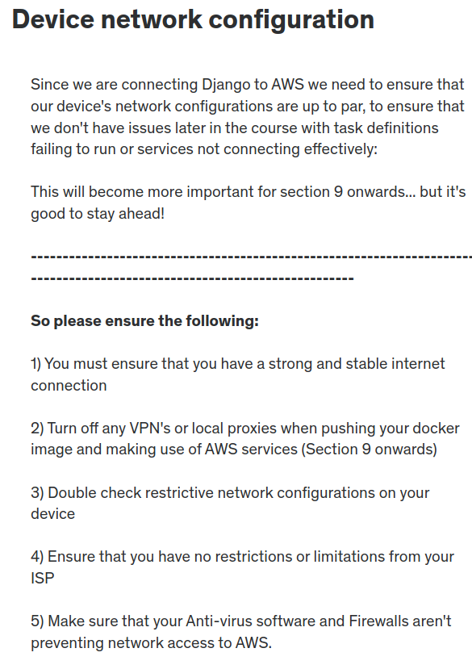
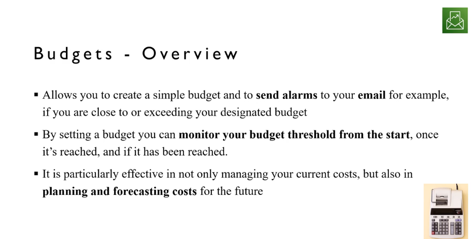
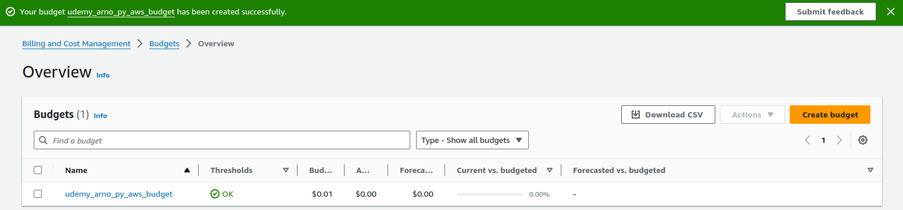

# AWS Configuration

## Network Overview

Before proceeding with AWS configuration, it's crucial to understand the network setup.  

  

## Creating an AWS Account

To get started with AWS, you need to create a Free Tier Account. Visit the [AWS Free Tier signup page](https://portal.aws.amazon.com/billing/signup) to begin.  

## Account Settings

### Selecting a Region

While setting the AWS Region might seem straightforward, it's important to note that using multiple regions can lead to complexities in the future. For consistency with the course, we recommend choosing the `US East (Ohio) us-east-2` region.  

-   Some services, like `S3`, have a default global region, while others, like `EC2`, are region-specific.

### Setting up a Budget (Critical)

#### Budget Overview

Creating a budget ensures you can manage your AWS expenses effectively.

  

#### Steps to Create a Budget

<!-- Need to check which one is looking better ? -->

1. **Navigate to Budgets**: Go to [AWS Budgets](https://us-east-1.console.aws.amazon.com/billing/home#/budgets) and select "Create Budget."

2. **Customize Budget**: Choose "Customized (advanced)" and select "Cost Budget."

3. **Budget Details**: Enter a name for your budget, set the budget amount (monthly), and choose the budget type (recurring).

4. **Specify Budget Scope**: Define the budget scope to include all AWS services.

5. **Set Alert Threshold**: Define the alert threshold percentage and provide email addresses for notifications.

6. **Review and Create**: Review your budget details and create the budget.

<!-- Need to check which one is looking better ? -->

<!-- Go to [AWS Budgets](https://us-east-1.console.aws.amazon.com/billing/home#/budgets) &rarr; Create Budget &rarr; **Customized (advanced)** &rarr; **Cost Budget** &rarr; Budget Name &rarr; Set budget amount: **Monthly** &rarr; **Recurring** budget &rarr; Start Month &rarr; **Fixed** &rarr; Budget scope: **All AWS services** &rarr; `Next` -->

<!-- -   Set Alert Thresold (any %) &rarr; Enter emails &rarr; `Next` &rarr; Review &rarr; `Create budget` -->

#### Budget Creation Result

Upon successful creation, your budget will be visible in the AWS Budgets dashboard.

## Additional Resources

For further guidance and information:

-   [AIO AWS Guide](https://github.com/open-guides/og-aws)  
-   [AWS Pricing](https://aws.amazon.com/pricing/)

These resources offer comprehensive insights into AWS services and pricing structures.