# AWS Integration Phase-I

## Cost Management

Understanding and managing costs is essential when working with AWS. Refer to the [AWS Pricing](https://aws.amazon.com/pricing/) page for detailed information.

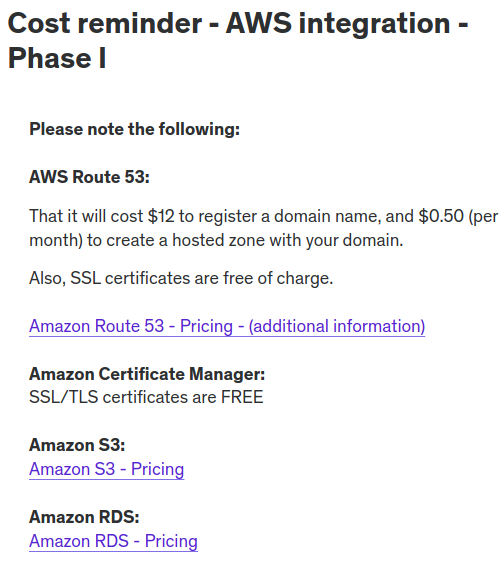

## Identity and Access Management (IAM)

IAM enables you to manage access to AWS services securely.

### Overview

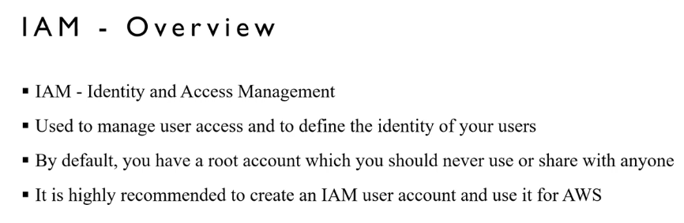

### Users & Group

IAM allows you to organize users into groups and manage permissions efficiently.

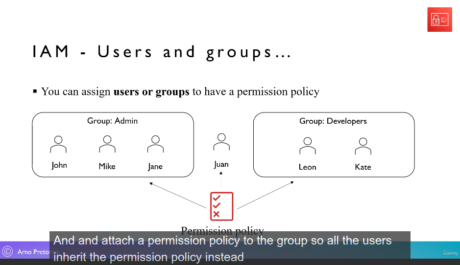

### Policies

Policies define permissions and access control for IAM users and groups.

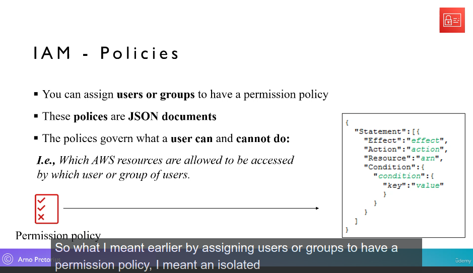

### Access Keys

Access keys are used for programmatic access to AWS services.

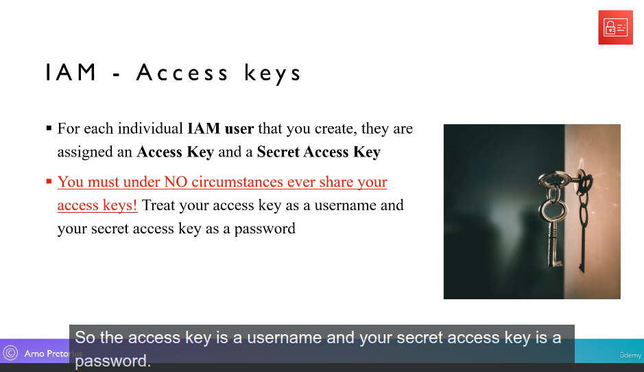

## IAM User and Group Creation

Creating IAM users and groups involves the following steps:

### Create a Group

-   IAM Dashboard &rarr; User groups &rarr; Create group &rarr; Group name (e.g, developers) &rarr; Attach Permission policies: Administrator Access, IAMU &rarr; `Create group`  

    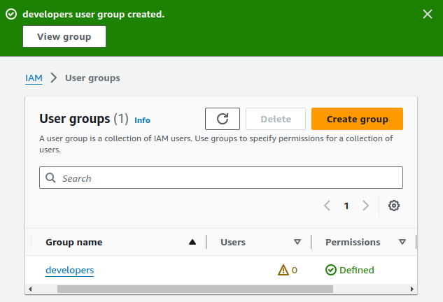  

### Create a User

-   IAM Dashboard &rarr; Users &rarr; Create User &rarr; Username &rarr; Provide user access &rarr; Create an IAM user &rarr; Set custom password &rarr; Next &rarr; Add user to the group &rarr; Next &rarr; `Create user`

    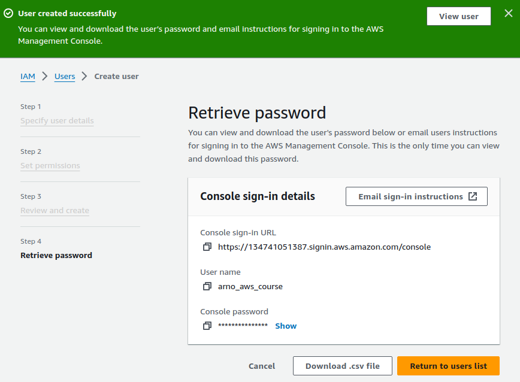

After completing the steps, users have the option to `email` the instructions or `download` them as a `.csv` file. Downloading as a `.csv` is recommended for easier access and offline reference.

### Utilization

Access IAM dashboard and sign in using credentials or alias.

-   IAM Dashboard &rarr; AWS Account &rarr; `Create alias`  

    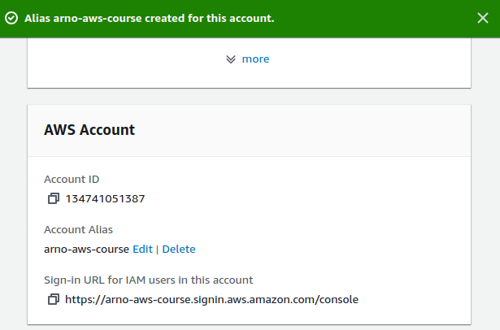

-   Access the login URL created by the alias and log in using your credentials (from the downloaded .csv file).  

    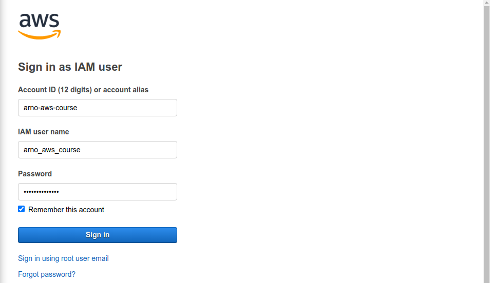

-   Upon successful login, account details will be displayed in the right-side panel.  

    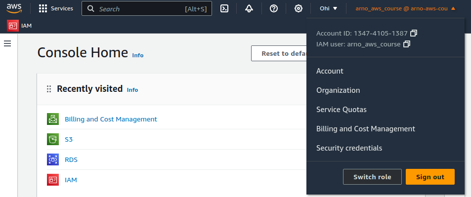

**Note:** It's essential to use IAM User accounts for accessing AWS resources and services. The Root user account should be reserved solely for account setup and billing management purposes.

### Security

Enabling Multi-Factor Authentication (MFA) enhances account security. 

-   IAM Dashboard &rarr; Add MFA &rarr; Device name &rarr; Authenticar app (recommended e.g, Google) &rarr; Input the required fields &rarr; `Add MFA`  

    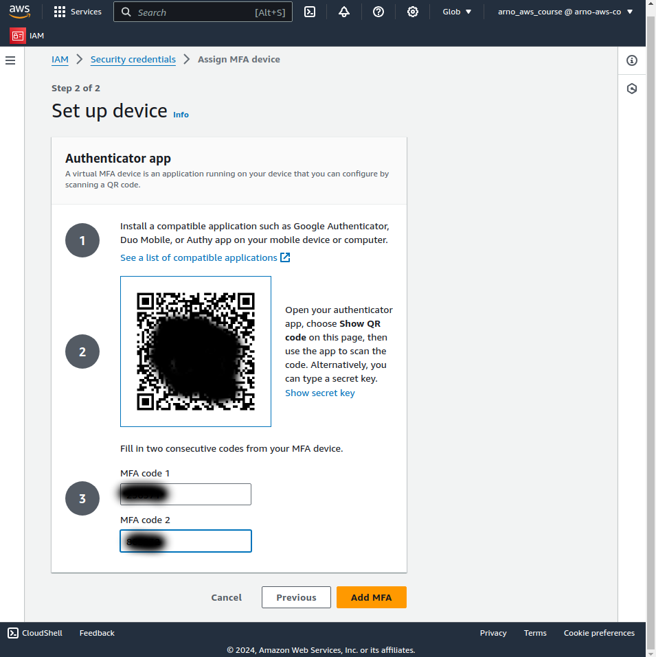  

-   After completing the setup, confirm the authentication in your dashboard.  

    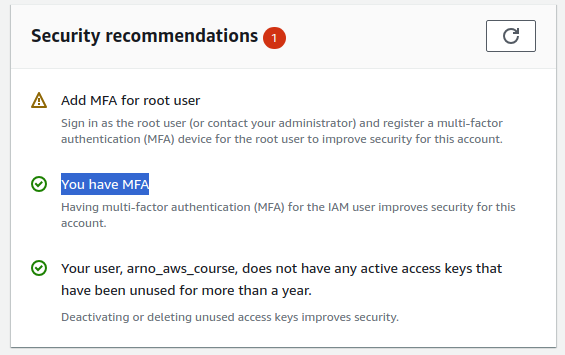  

-   Repeat the same process to set up MFA for your Root user.  

    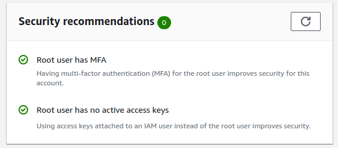  

### Setting Up Access Keys

To facilitate communication between our application and AWS services like S3 bucket, we require access keys.

-   IAM Dashboard &rarr; Users &rarr; Select user &rarr; Security credentials &rarr; Creat Access Keys &rarr; Local code &rarr; Next &rarr; Skip tag &rarr; `Create`  

    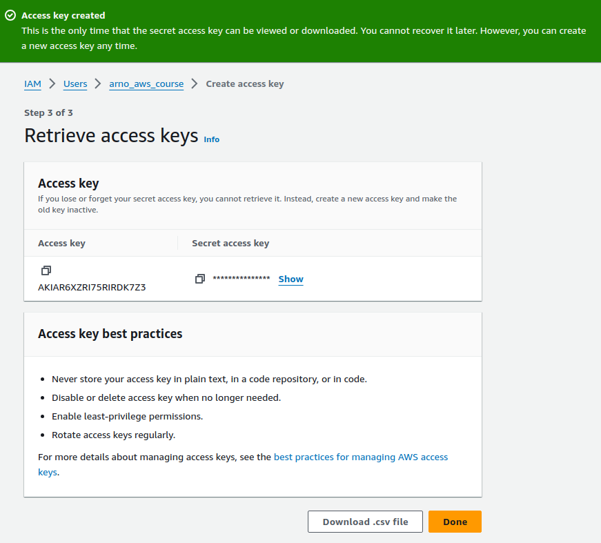

Be sure to download the generated `.csv` file for future reference.

## AWS CLI

Setup AWS CLI using the [official guide](https://docs.aws.amazon.com/cli/latest/userguide/getting-started-install.html).

## Amazon Simple Storage Service (S3)

S3 provides object storage for a wide range of use cases.

### Overview

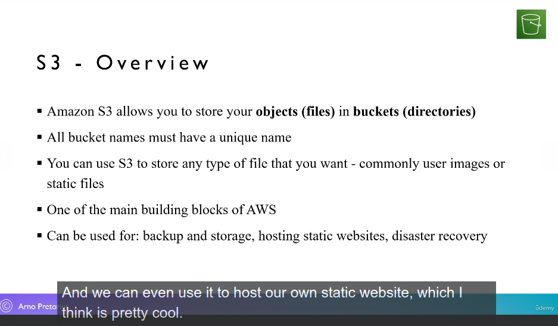  

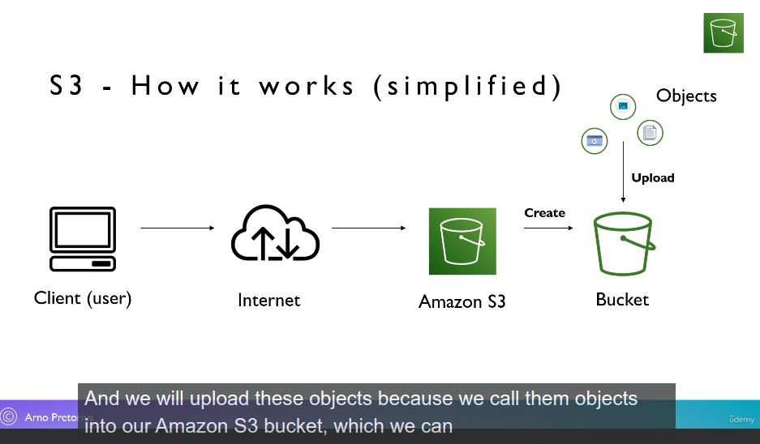

### Setting up S3

#### Create a Bucket

Specify bucket name and configure access settings.

-   Navigate to S3 &rarr; Create bucket &rarr; Give bucket name &rarr; **Uncheck Block all public access** &rarr; `Create bucket`

    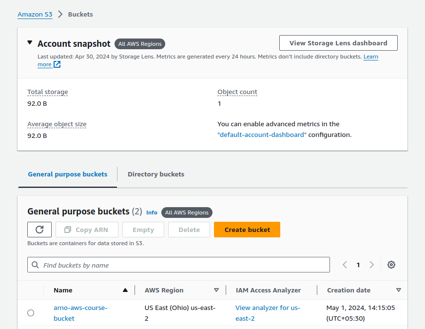

#### Tweak Permissions

Configure bucket policies for public access.

-   Select the bucket &rarr; Permissions &rarr; **Block public access (bucket settings) off** &rarr; Bucket policy &rarr; Policy generator (open in new tab)  

-   Policy generator &rarr;  
    -   Type of Policy: S3 Bucket Policy  
    -   Statements:  
        -   Effect: Allow  
        -   Principal: *
        -   Actions: GetObject
        -   Copy & Paste the ARN and add a forward / with *  
            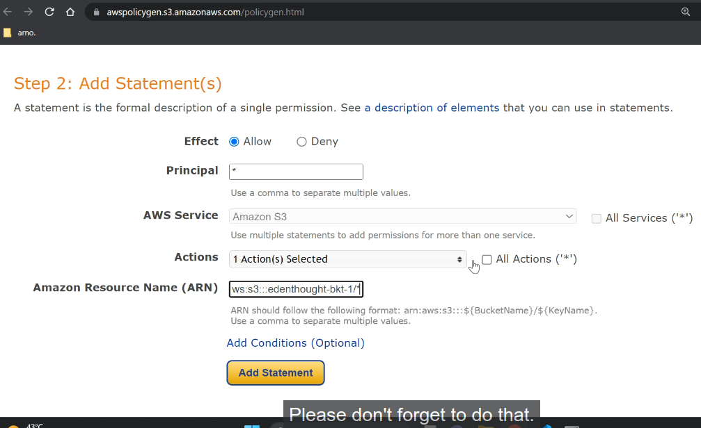  

-   Add Statement &rarr; Generate Policy &rarr; Copy the JSON Policy &rarr; Paste in Bucket Policy &rarr; `Save changes`

    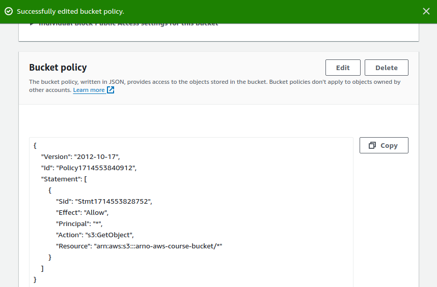

### Integration

#### Installation  

To integrate S3 with your app, follow these steps:

1.  Install the required packages using pip:  

    ```
    pip install -U boto3  
    pip install -U django-storages
    ```

2.  Add the installed packages to your Django project's settings:  

    ```py title="settings.py"
    INSTALLED_APPS = [
    # other apps
    'storages',
    ]
    ```

This ensures that the necessary libraries are installed and configured for S3 integration within your Django application.

#### Config Models

To configure your models for S3 integration, follow these steps:

1.  Add an upload folder named `images` in the Profile picture model. This ensures that when a picture is uploaded, it will be saved in a folder named `images` in our S3 bucket.

    ```py title="your_app_name/models.py"
    class Profile(models.Model):
        profile_pic = models.ImageField(blank=True, null=True, default='default.png', upload_to='images/')  # Define upload_to as 'images'
        user = models.ForeignKey(User, max_length=10, on_delete=models.CASCADE, null=True)
    ```

2. Run migrations to apply the changes to your database schema:  

    ```
    python manage.py makemigrations
    python manage.py migrate
    ```

    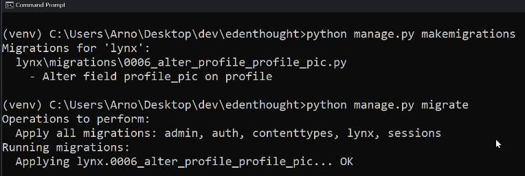

    This ensures that the necessary database changes are made to accommodate the new configuration.

These steps configure your Django models to handle image uploads and ensure that they are saved in the specified `images` folder within your S3 bucket.

#### Setup `settings.py`

Configure AWS settings in your settings.py file as follows:

```py title="settings.py"

#  # IAM accessKeys from .csv file
AWS_ACCESS_KEY_ID = ''  # Add your Access Key ID here
AWS_SECRET_ACCESS_KEY = ''  # Add your Secret Access Key here

# AWS S3 configuration
AWS_STORAGE_BUCKET_NAME = ''    # Add your S3 bucket name here

# Storage configuration for S3 for Django >= 4.2
STORAGES = {

    # Media file (image) management
    "default": {
        "BACKEND": "storages.backends.s3boto3.S3Boto3Storage",
    },

    # Static file management
    "staticfiles": {
        "BACKEND": "storages.backends.s3boto3.S3Boto3Storage",
    },
}

# Show a unique URL for the uploaded image
AWS_S3_CUSTOM_DOMAIN = '%s.s3.amazonaws.com' % AWS_STORAGE_BUCKET_NAME

# Ensure we don't overwrite any existing files
AWS_S3_FILE_OVERWRITE = False
```

Replace the placeholders with your actual IAM access keys and S3 bucket name. These settings enable Django to interact with your AWS S3 bucket for storing and retrieving files.

#### Storing Static Files in S3

Upload static files to your S3 bucket for serving content usign these steps:

1.  Check if your S3 bucket is empty.  

    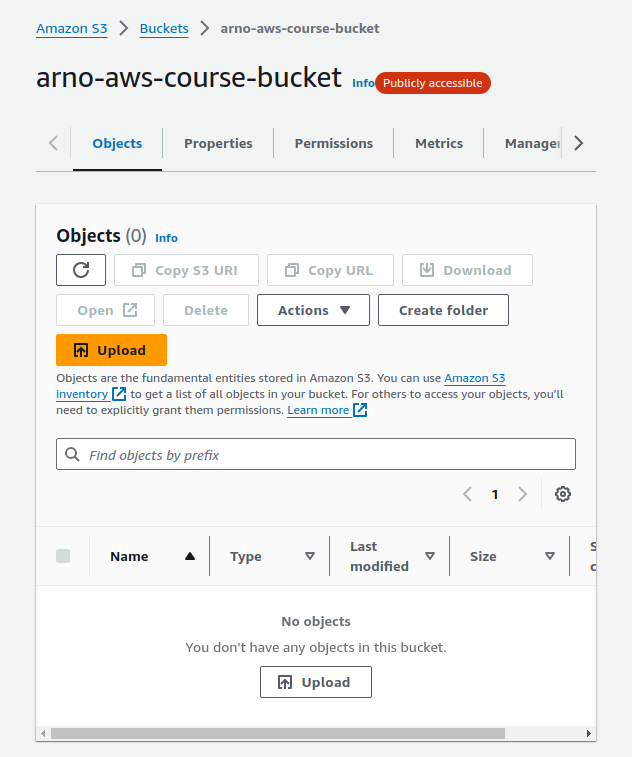  

2.  Run the following command in your terminal and select `yes` to confirm:

    ```
    python manage.py collectstatic
    ```

    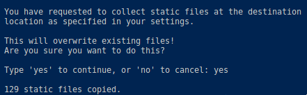

3.  Wait for a few minutes for the files to be uploaded to your S3 bucket.

4.  Refresh your S3 bucket to ensure all the files are successfully uploaded.

    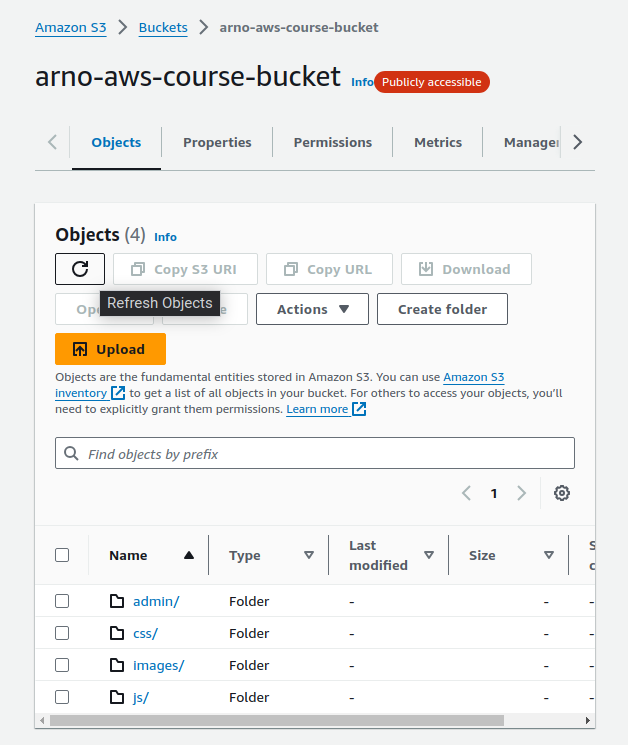  

**Note**: If you encounter any issues while loading the `default.png` file, ensure it is located in the root folder of your S3 bucket.

## Amazon Relational Database Service (RDS)

RDS offers managed database services for various database engines.

### Overview

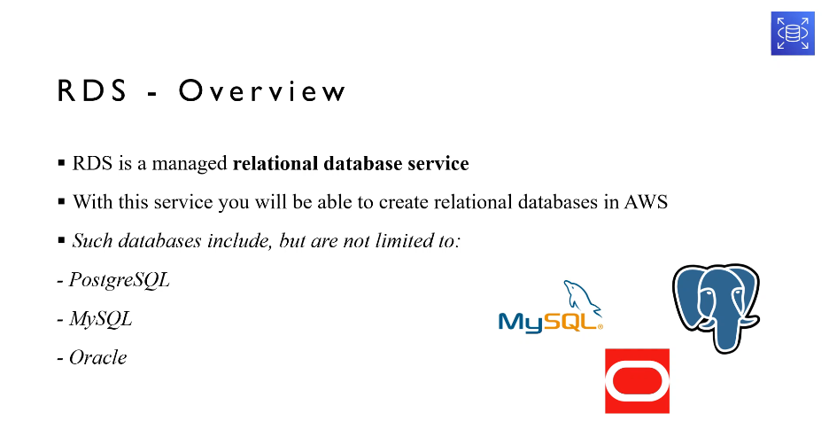  

### Setting up RDS

Follow these steps to set up your PostgreSQL database using Amazon RDS:

#### Create an Instance

-   Go to RDS &rarr; Resources &rarr; DB Instances &rarr; Create database &rarr; Standard create &rarr; PostgreSQL &rarr; Free tier &rarr; DB instance identifier (arno-aws-course-postgredb) &rarr; Master username (e.g, postgres_1) &rarr; Set password &rarr; DB instance class &rarr; db.t3.micro &rarr; Storage (default) &rarr; Connectivity &rarr; **Public Access: Yes** &rarr; Additional config &rarr; DB port &rarr; Monitoring (default) &rarr; **Additional Configuration** &rarr; Set database name (e.g, arno_aws_course) &rarr; `Create database`

    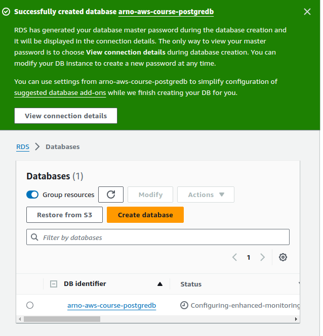

#### Set Inbound Rules

1.  Go to Security Groups and click on the group ID associated with your RDS instance.  
2.  Navigate to the "Inbound rules" section and click on "Edit inbound rules."  
3.  Add two rules:  
    -   Type: PostgreSQL, Source: any IPv4 0.0.0.0/0  
    -   Type: PostgreSQL, Source: any IPv6 ::/0  
4.  Click on "Save rules" to apply the changes.  

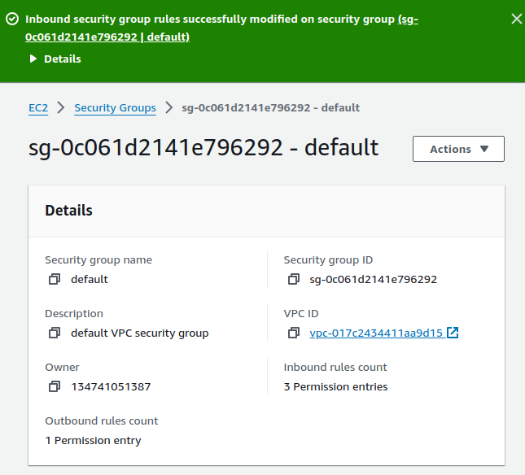  

### Integration

#### Installation

Execute the following command to install the necessary package:

```
pip install -U psycopg2-binary
```

#### Setup `settings.py`

Configure your AWS RDS PostgreSQL database in the settings.py file of your Django project as follows:

```py title="settings.py"
DATABASES = {
    'default': {
        'ENGINE': 'django.db.backends.postgresql',
        'NAME': '',         # Initial database name
        'USER': '',         # Master username
        'PASSWORD': '',     # Master password
        'HOST': '',         # Copy the endpoint from the RDS dashboard
        'PORT': '5432',     # Default port for PostgreSQL
    }
}
```

**Note**: Ensure to comment out or remove your default SQLite database settings before using RDS.

#### Connect the database

Follow these steps to connect your database:

1.  **Check for Unapplied Migrations**:  

    Run your Django server and check if there are any unapplied migrations. If you see a message similar to the one shown in the screenshot below, it means your database is successfully connected:  

    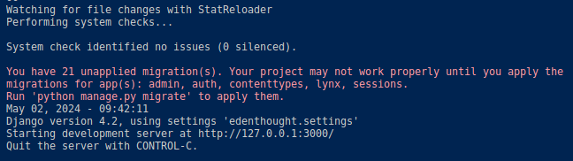  

2.  **Stop the Server and Run Migrations**:  

    Stop the server and execute the following commands to run migrations:

    ```
    python manage.py makemigrations
    python manage.py migrate
    ```

3.  **Create a New SUDO**:  
    
    After completing the migrations, create a new [SUDO](section_4_2.md#create-sudo) as per the instructions provided.

## Amazon Route 53

Route 53 is a scalable domain name system (DNS) web service.

### Overview

Here's an overview of Route 53, including its use cases, DNS resolution, various routing policies, and examples:

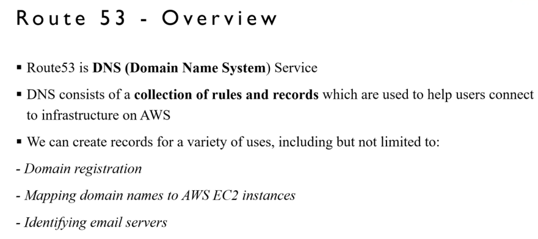  

-   **Use Cases**:  

    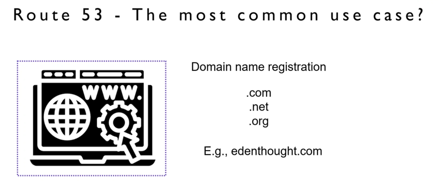  

-   **DNS Resolution**:  
    
    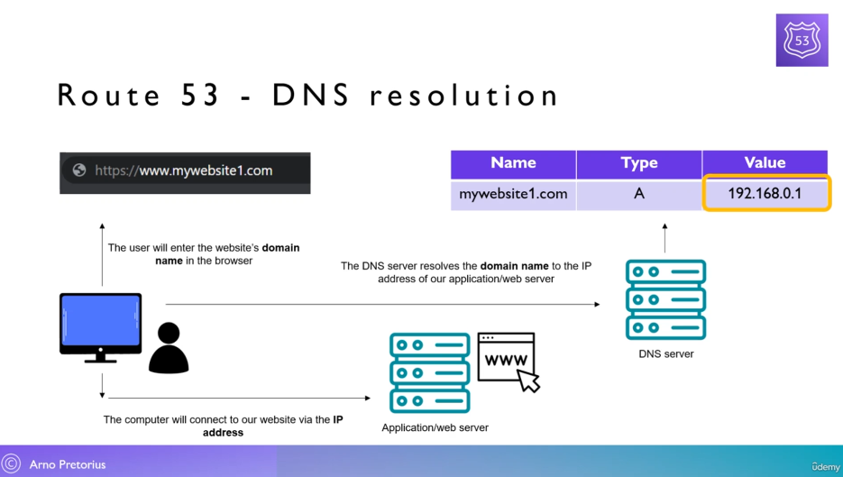  

-   **DNS Records**:  

    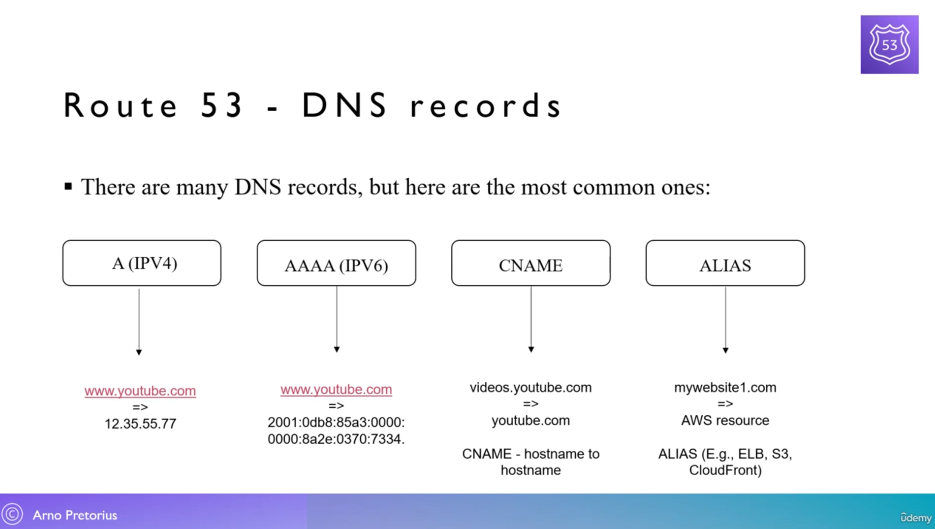  

-   **Routing Policies**:  

    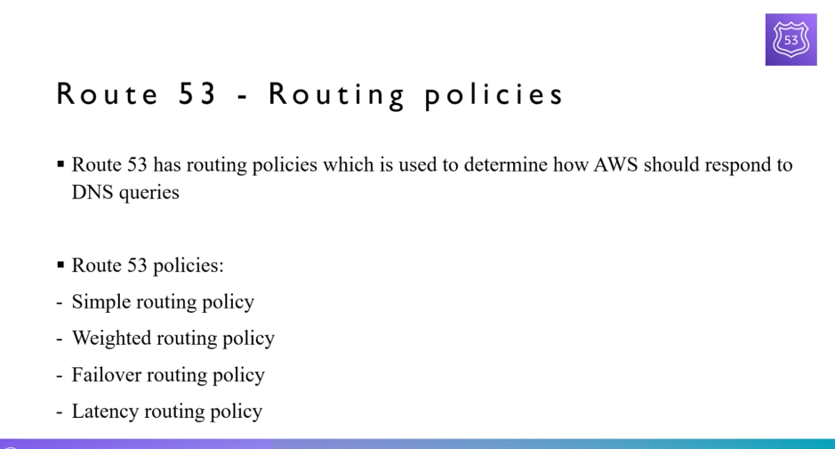  

-   **Simple Routing**:  

    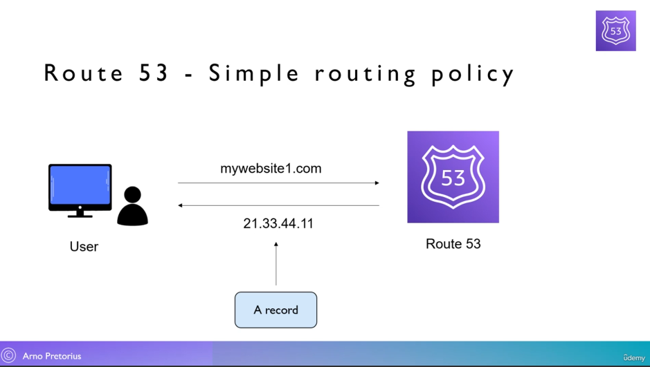  

-   **Weighted Routing**:  

    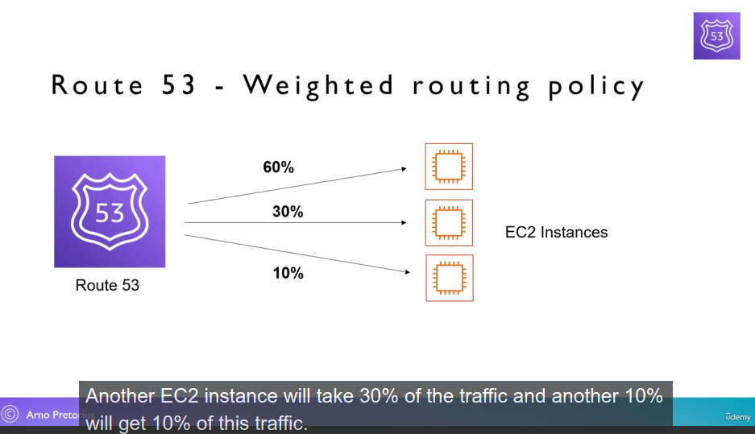  

-   **Failover Routing**:  
    
    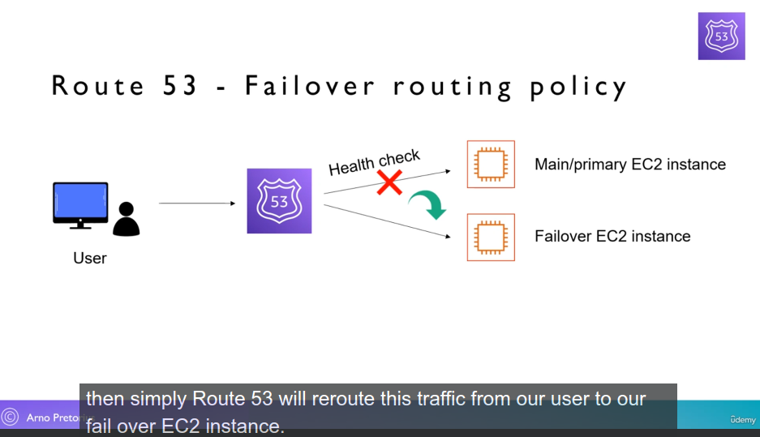  

-   **Latency Routing**:  

    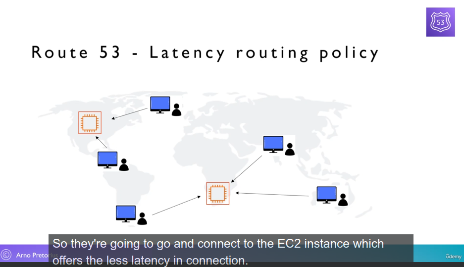  

### Setup Route53

If you already have a domain, you can transfer its registration to Route53 using [this guide](https://docs.aws.amazon.com/Route53/latest/DeveloperGuide/domain-transfer-to-route-53.html).

#### Register a Domain

1.  Go to Route53.
2.  Navigate to Domains > Registered Domains.
3.  Click on "Register domains" and search for your desired domain name.
4.  Select your domain and check the price.
5.  Proceed to checkout.  

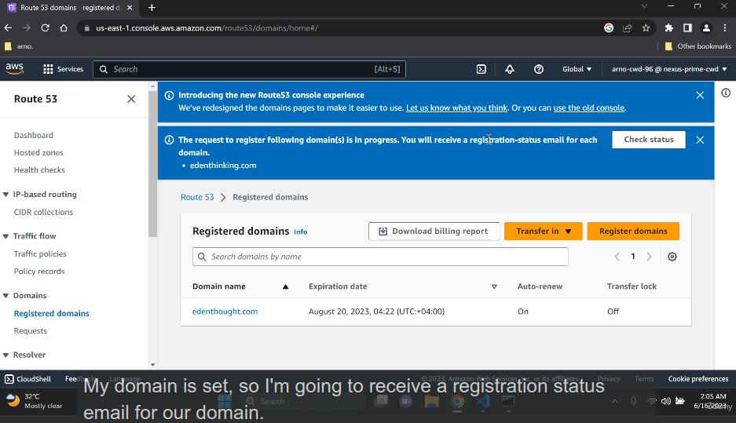

### Integration

#### Amazon Certificate Manager

Amazon Certificate Manager (ACM) enables you to provision, manage, and deploy SSL/TLS certificates for use with AWS services.

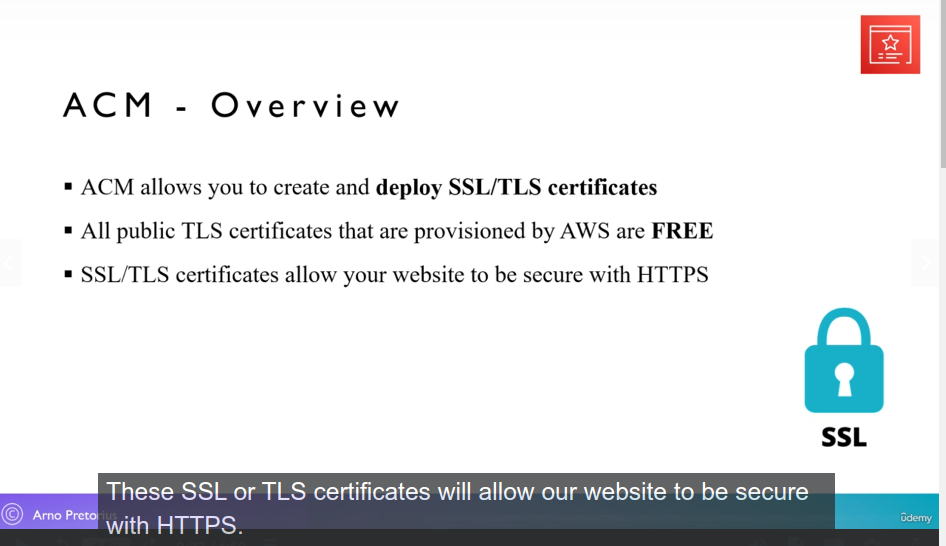  

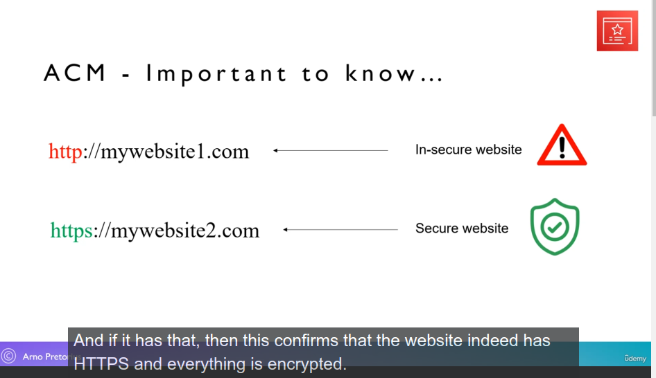  

**Important:** To apply a certificate, you must have purchased a domain name; otherwise, this step is not applicable. You can `skip` this part if you don't have a domain name.

#### Certificate Provision

Provision SSL certificates and configure DNS records for secure communication

1.  Go to Certificate Manager.
2.  Request a certificate and choose "Request a public certificate."
3.  Add domain names for which you want to generate the certificate.  

    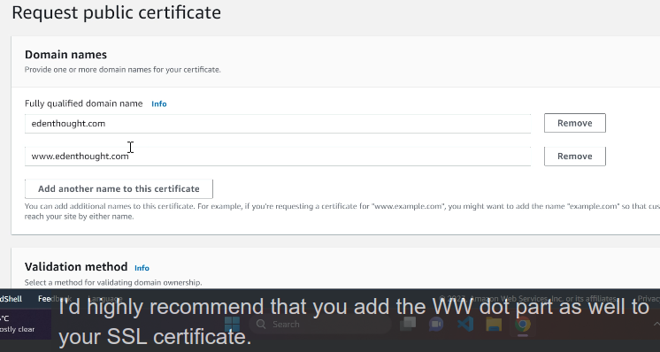  

4.  Choose the validation method as DNS and select any key algorithm. Then, click on "Request."

5.  After generating the certificate, note the CNAME name and CNAME value.  

    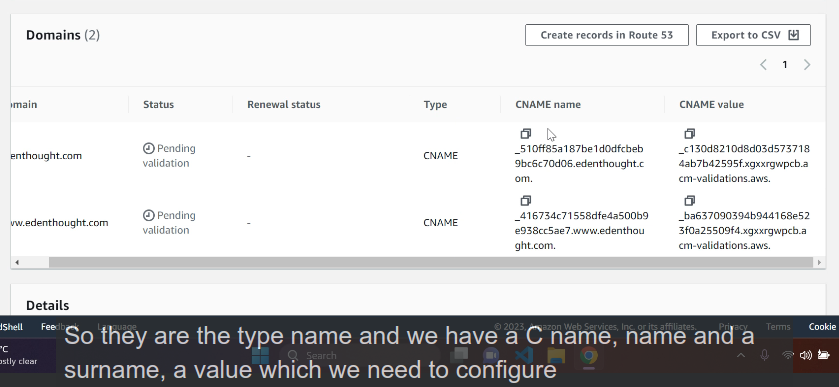

6.  Go to Hosted Zones and navigate to your registered domain.
7.  Create a new record:  

    -   Enter the CNAME name in the Record name field.  

        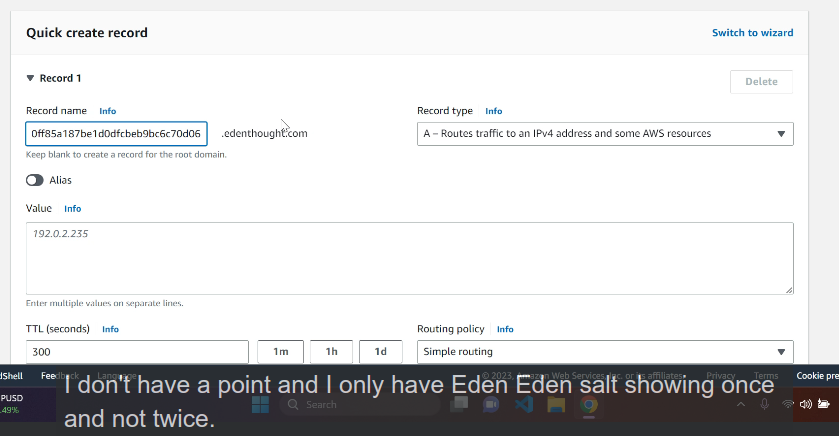  

    **Note**: Don't forget to remove ".yourwebsite.com" from the end of the CNAME.

    -   Enter the CNAME value in the Value field.  
    -   Choose the record type as CNAME and add another record for the www DNS.  
    -   Click on "Create records."

    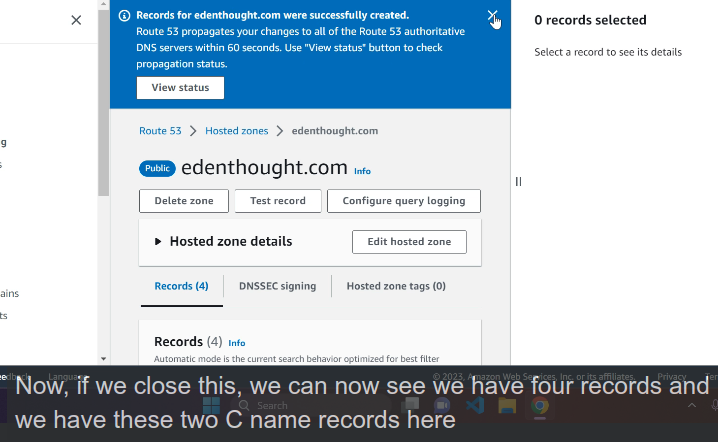

**Important**: SSL validation may take up to several hours or 1-2 days. Please wait until the status shows "Issued."