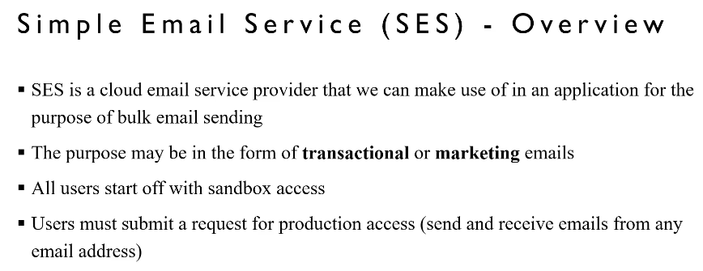
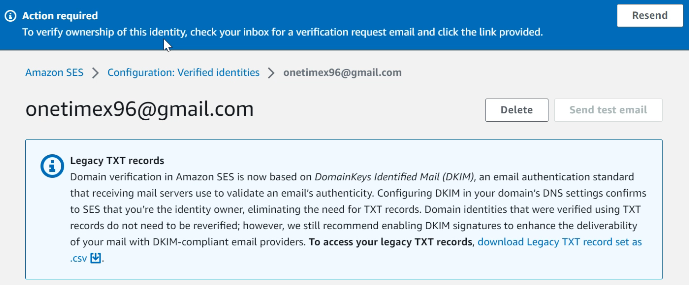
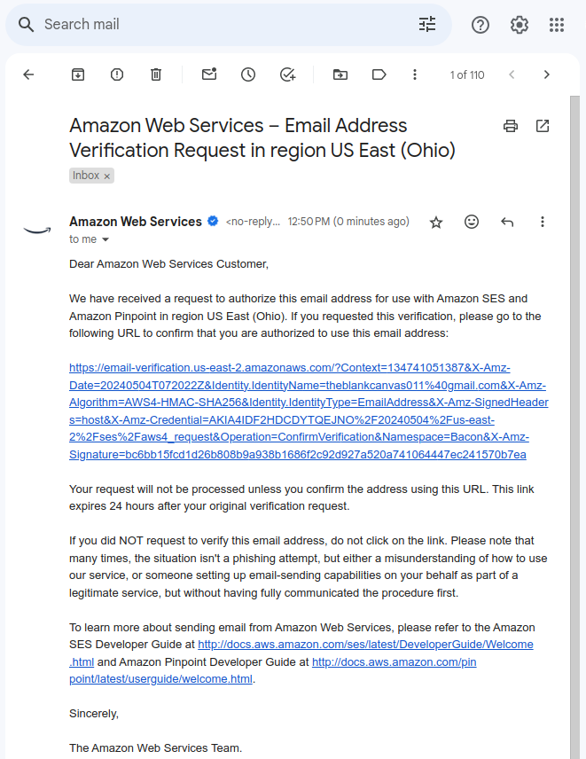
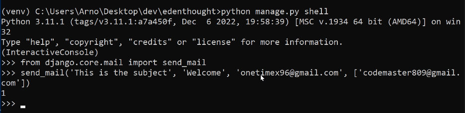
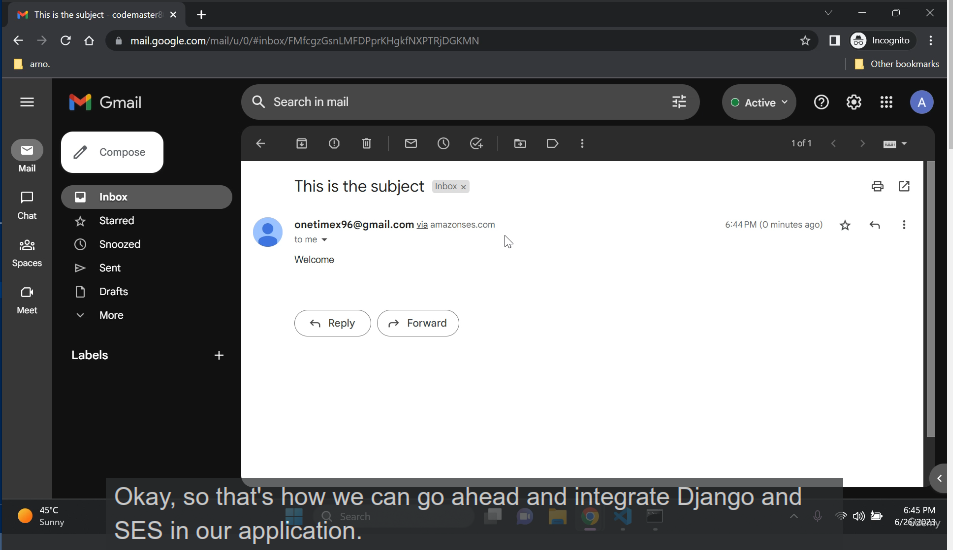
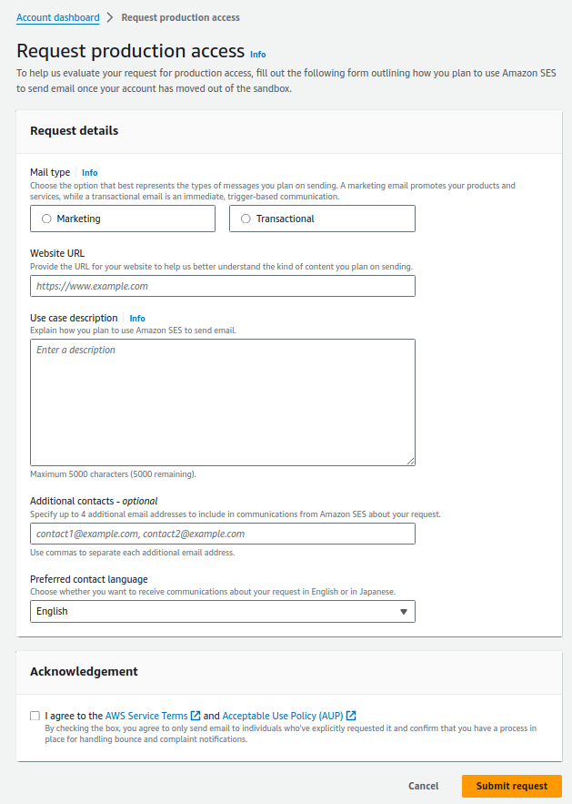
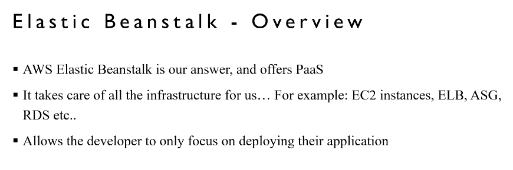
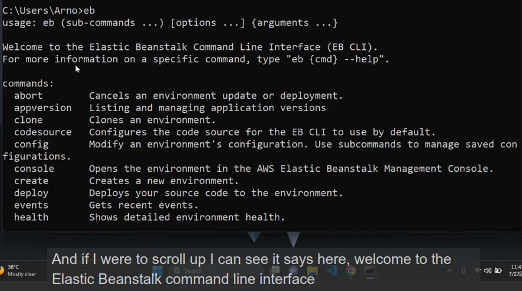

# AWS Integration Phase-II

## Amazon Simple Email Service (SES)

Amazon Simple Email Service (SES) is a cloud-based email sending service to send transactional, promotional, and other types of emails to customers.

### Overview



### Setting up SES

#### Create a Sender Identity (Sandbox Mode)

It is an domain, subdomain or an email to utilize to send emails through SES.

-   From address:

    -   SES Dashboard &rarr; Identities &rarr; Create identity &rarr; Indentity Details: Email address &rarr; Set email address  &rarr; `Create Identity`  

      

    -   Verify the provided email address.

          

-   To address:  
    
    Repeat the previous steps to create another email for the "To address".

**Optional Note**: If encountering issues with SES access, update IAM User policies with "AmazonSESFullAccess".

### Integration

#### Installation

Execute the following command to install the necessary package:

```
pip install -U django-ses
```

#### Setup `settings.py`

Update your settings to integrate SES:

```py title="settings.py"
EMAIL_BACKEND = 'django_ses.SESBackend'
AWS_SES_REGION_NAME = 'us-east-2'   # for Ohio
AWS_SES_REGION_ENDPOINT = f'email.{AWS_SES_REGION_NAME}.amazonaws.com'
```

#### Send Test Mail

Test your SES configuration by sending a test email using Python shell:

-   Code:

    ```
    python manage.py shell
    ```

    ```
    from django.core.mail import send_mail
    send_mail("Subject", "Body", "From address", ["To address 1", "To address 2"])
    ```

      

    A success output "1" confirms the email was sent.

-   Verify:

      

#### Production Access

Here we don't need to add any sender email address, rather we can mail any email address we want. Gain access for production use by following these steps:

-   SES Dashboard &rarr; View get set up page &rarr; Request production access  &rarr; Fill the form as per your requirements &rarr; `Submit request`

      

-   Further details on production access can be found [here](https://docs.aws.amazon.com/ses/latest/dg/request-production-access.html)

## AWS Elastic Beanstalk (EB)

Amazon Elastic Beanstalk (EB) simplifies the deployment and management of web applications and services in the cloud.

### Overview



### Setting up EB

#### Install EB CLI

**Note**: To ensure a smooth installation, EB CLI and pyyaml 5.3.1 package need to be installed **globally**.

```
pip install pyyaml==5.3.1 awsebcli
```

After installation, type `eb` in the terminal to confirm successful setup.

  

For additional macOS instructions, refer to the [guide](https://docs.aws.amazon.com/elasticbeanstalk/latest/dg/eb-cli3-install-osx.html)

### Integration

#### Installation

Execute the following command to install the necessary package:

```
pip install -U gunicorn
```