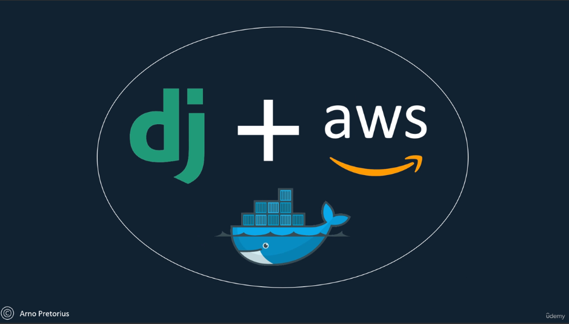
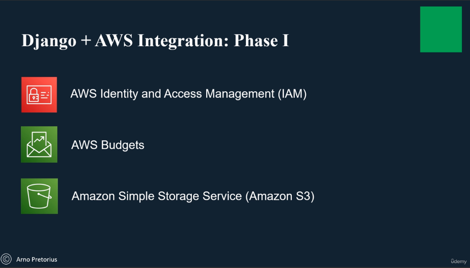
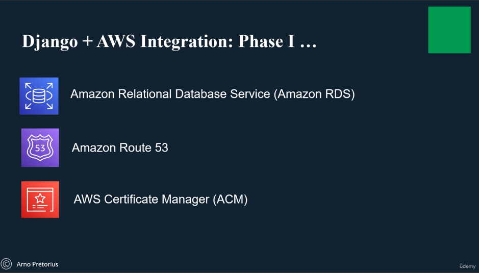
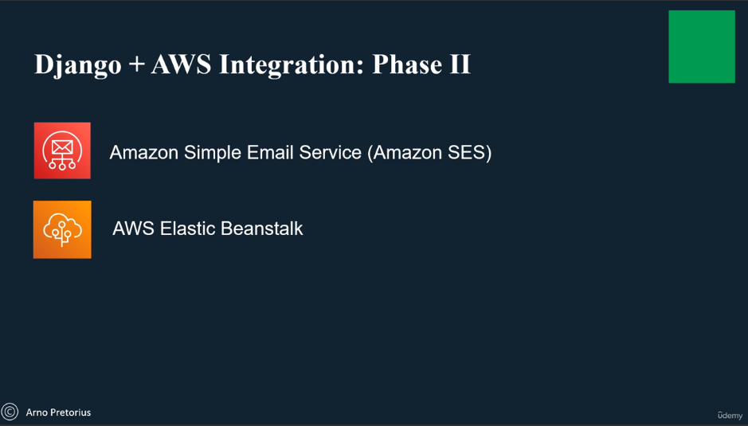
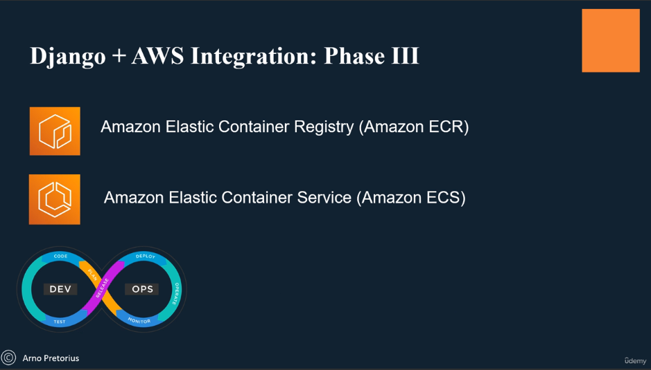
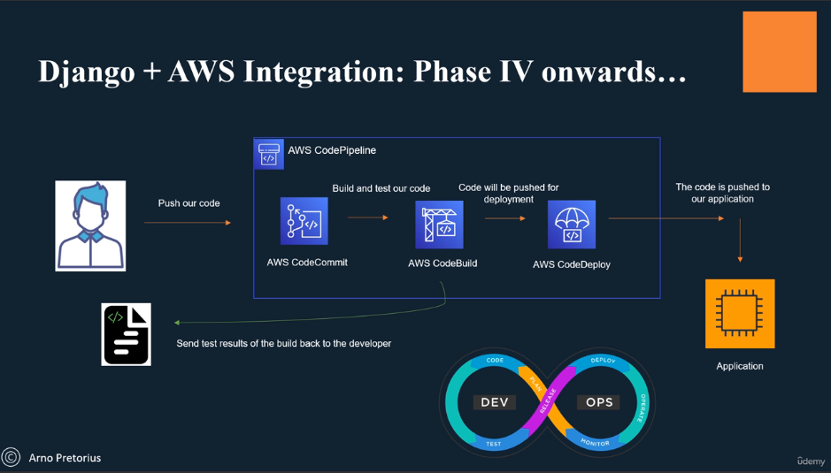

# Introduction

## Course Objectives

Master the Fundamentals of AWS development with Python Django by:  

- Learning to build scalable web applications using Django and AWS services.  
- Understanding the principles of cloud computing and how to leverage AWS for web development.
- Gaining hands-on experience with deployment, CI/CD, and monitoring in AWS environments.

## Course Prerequisites

This course is suitable for learners with:  

- Basic knowledge of HTML, CSS, and JavaScript.
- Familiarity with Django (optional revision provided in Section 4).
- Interest in AWS and cloud computing concepts.

## Course Structure

  
Overview of the course objectives and structure.

  
Introduction to AWS Fundamentals.

  
Building and Deploying Django Applications on AWS.

  
CI/CD Pipelines with AWS CodePipeline and CodeDeploy.

  
Monitoring and Logging with AWS CloudWatch.

  
Advanced Topics: Serverless Computing, Containers, and more.

## What You'll Learn

By the end of this course, you'll be able to:  

- Understand the core concepts of AWS and cloud computing.
- Integrate AWS services within Django applications to build scalable and resilient web solutions.
- Implement deployment strategies and set up CI/CD pipelines for automated software delivery.
- Monitor and analyze application performance using AWS CloudWatch and CloudTrail.

## Tips & Tricks

Here are some practical tips to enhance your learning experience:  

- Don't hesitate to experiment with different AWS services and configurations.
- Take advantage of AWS free tier resources for hands-on practice.
- Stay updated with the latest AWS announcements and best practices.

## Project Resources

This section will provide additional resources such as project templates, code samples, and supplementary materials to support your learning journey.