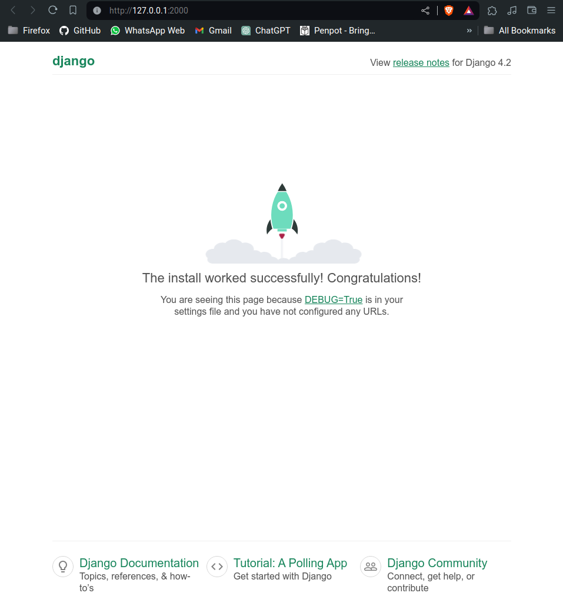
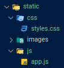
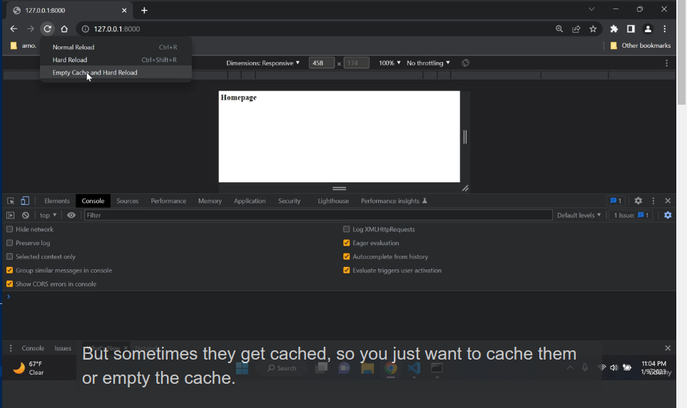
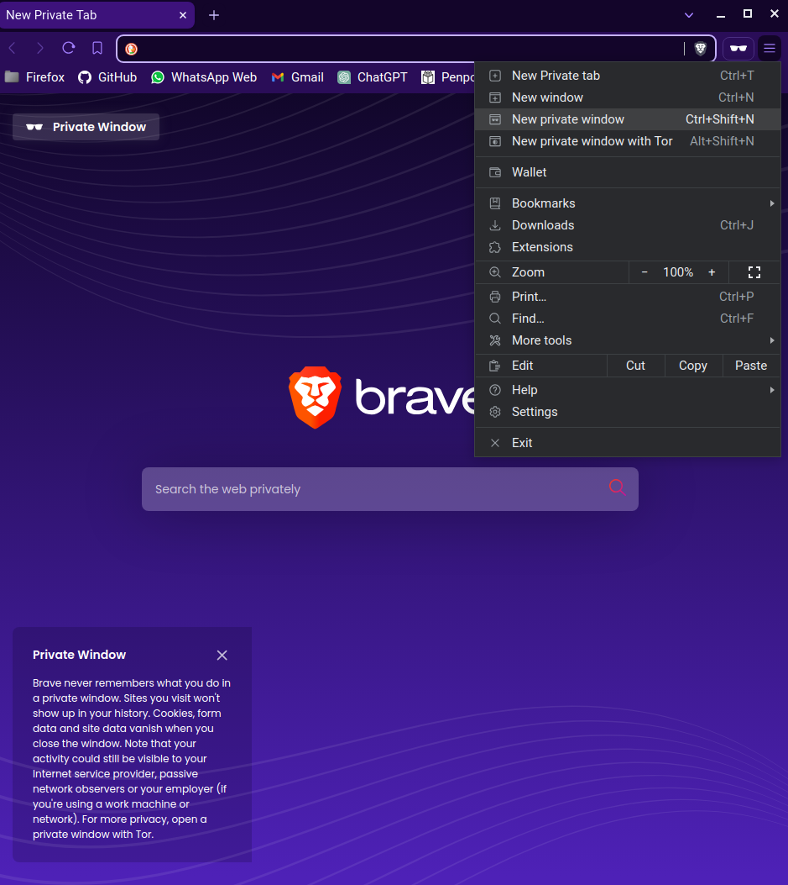
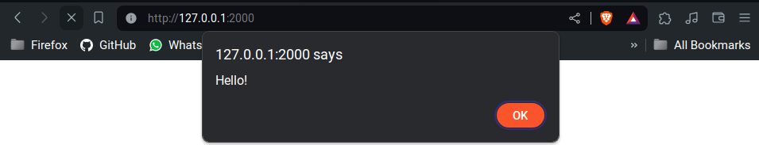
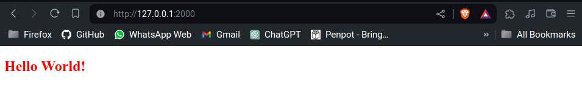

# Hands-on-Django

**Note: This section covers the basics of setting up a Django project.**

## Setup Project

- Create a new Django project:
    ```bash
    django-admin startproject <your_project_name> .
    ```

- Run the Django development server:
    ```bash
    python manage.py runserver
    ```

- Verify that the server is running by visiting [http://localhost:8000/](http://localhost:8000/) in your web browser.

    

## Working on the App

### Create a New App

```bash
django-admin startapp <your_app_name>
```

### Configure Django Settings

Add the new app to the `INSTALLED_APPS` list in your project's `settings.py` file:

```py title="settings.py"
INSTALLED_APPS = [
    'django.contrib.admin',
    'django.contrib.auth',
    'django.contrib.contenttypes',
    'django.contrib.sessions',
    'django.contrib.messages',
    'django.contrib.staticfiles',  
    'lynx',
]
```

### Two-Way Template Setup

1.  Project-level templates:  

    -   Create a `templates` folder in the project's root directory.
    -   Configure the `DIRS` setting in `settings.py` to include the templates folder.

    ``` py title="settings.py"
    TEMPLATES = [
        {
            'BACKEND': 'django.template.backends.django.DjangoTemplates',
            'DIRS': ['templates'],  # here
            'APP_DIRS': True,
            'OPTIONS': {
                'context_processors': [
                    'django.template.context_processors.debug',
                    'django.template.context_processors.request',
                    'django.contrib.auth.context_processors.auth',
                    'django.contrib.messages.context_processors.messages',
                ],
            },
        },
    ]
    ```

2.  App-level templates:  

    -   Create a `templates` folder in the app's directory and start working.  
    <sub>(used in this project)</sub>

### URLs Configuration

-   Create `urls.py` in the app level:

    ``` py title="your_app_name/urls.py"

    from django.urls import path

    from . import views

    urlpatterns = [
        path('', views.index, name='index'),
    ]
    ```

-   Link the app-level URLs to the project-level URLs:

    ``` py title="your_project_name/urls.py"

    from django.contrib import admin
    from django.urls import path, include   # here

    urlpatterns = [
        path('admin/', admin.site.urls),
        path('', include('lynx.urls')),     # here
    ]
    ```

### Views and Templates

-   Create `views.py` in app level:

    ``` py title="your_app_name/views.py"

    from django.shortcuts import render

    def index(request):
        return render(request, 'index.html')
    ```

-   Create `index.html` template in the templates folder of your app.

    ```html title="your_app_name/templates/index.html"
    <!DOCTYPE html>
    <html lang="en">
    <head>
        <meta charset="UTF-8">
        <meta name="viewport" content="width=device-width, initial-scale=1.0">
        <title>Document</title>
    </head>
    <body>
        <h2>Hello World!</h2>
    </body>
    </html>
    ```

##   Static files are not Static?

In Django, static files such as CSS, JavaScript, and images are served directly by the web server.  

### Static Files Configuration  

Follow these steps to configure static files:  

-   Create a `static` folder in the root directory directory of your project.  
    
      

-   Inside the `static` folder, create subfolders for CSS, JavaScript, and other assets.

    ```css title="static/css/styles.css"
    h2 {
        color: red;
    }
    ```

    ```js title="static/js/app.js"
    alert("Hello!");
    ```

-   Configure `settings.py` to include the `static` folder:

    ```py title="settings.py"

    STATIC_URL = '/static/'

    STATICFILES_DIRS = [
        BASE_DIR / "static"
    ]
    ```

-   Load static files in your templates using the `` template tag.

    ```html title="your_app_name/templates/index.html"
    

    <!DOCTYPE html>
    <html lang="en">

    <head>
        <meta charset="UTF-8">
        <meta name="viewport" content="width=device-width, initial-scale=1.0">
        <link rel="stylesheet" type="text/css" href="">
        <title>Document</title>
    </head>

    <body>
        <h2>Hello World!</h2>
    </body>

    <script src=""></script>

    </html>
    ```

### Refresh Static Files

Sometimes changes to static files may not reflect immediately due to browser caching. You can use the following methods to refresh static files:  

1.  **Hard Reload:** Developer Tools &rarr; Right-click on reload button &rarr; Empty Cache.

    

2.  **Use Incognito Tab:** Open the project in an incognito tab to avoid caching.   
    <sub>(recommended)</sub>  

    

##  Running the Project

Run the Django development server:  

```bash
python manage.py runserver
```

If the server starts successfully, and you see the Django welcome page, congratulations! You have successfully set up a basic Django project.  

  

  