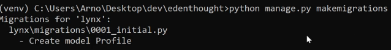
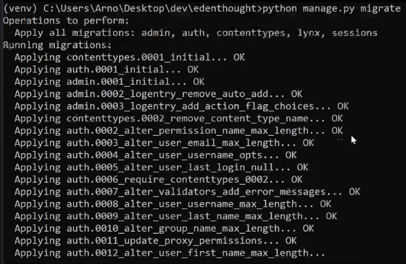
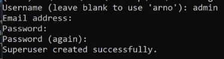
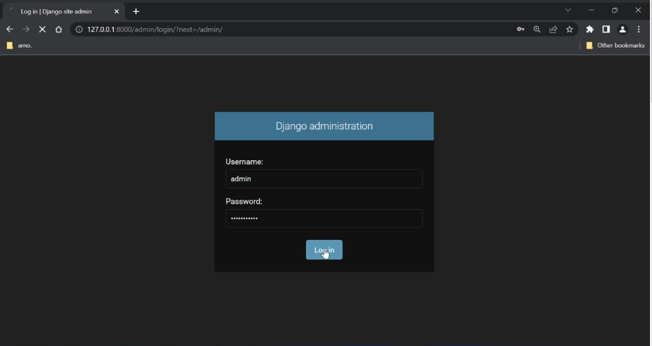
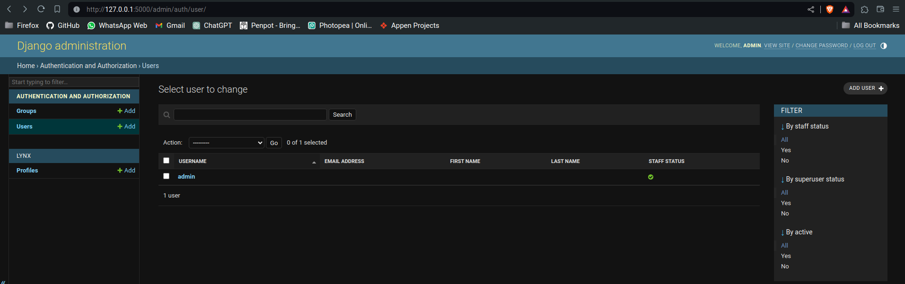
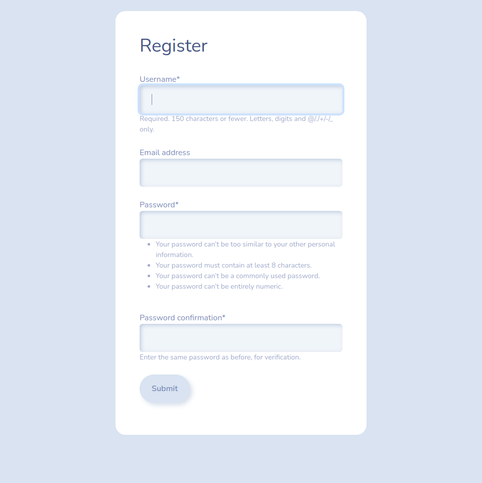
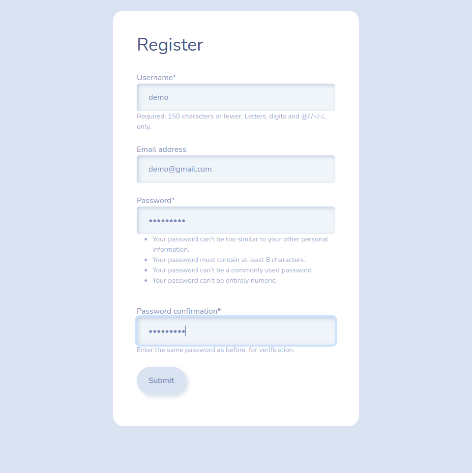
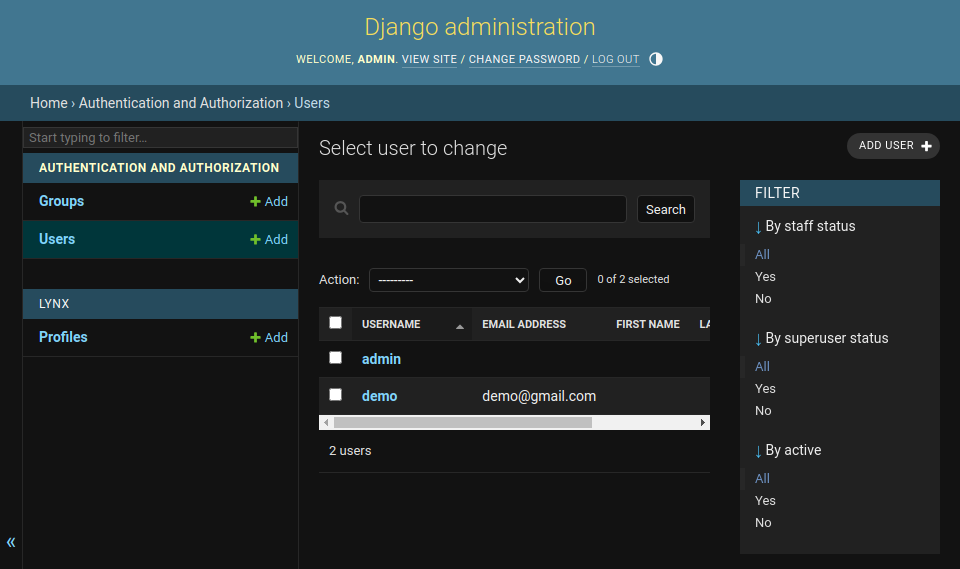

# Scaling the Project

**Note: This section is optional but essential for scaling the project.**

<sub>For the sake of simplicity, the styling portion of this course is skipped. Please download the templates from the course resources.</sub>

## Database Setup

### Models

In Django, models are Python classes that represent database tables.

#### Creating a Model

Let's create a `Profile` model by extending the default `User` model provided by Django. It's recommended to define models within the respective app for better organization.

```py title="your_app_name/models.py"
from django.db import models
from django.contrib.auth.models import User

class Profile(models.Model):
    profile_pic = models.ImageField(blank=True, null=True, default='default.png')
    user = models.ForeignKey(User, on_delete=models.CASCADE, null=True)
```

While the process may seem straightforward, understanding the use of the image field and the significance of 'default.png' requires delving deeper into the configuration of [media](#configure-media-files) settings.

#### Register the Model

Register the `Profile` model in the admin panel for easy management.  

```py title="your_app_name/admin.py"
from django.contrib import admin

from .models import Profile

admin.site.register(Profile)
```

<sub>Note: Django default uses SQLite Database as **db.sqlite3** which can be seen in the project root.</sub>

### Migration

To apply the model changes to the database, perform migrations:

```
python manage.py makemigrations
```



```
python manage.py migrate
```



If the migration process completes without errors, your database is ready for use.

## Configure Media Files

-   Install [Pillow](https://pypi.org/project/pillow/) library for image processing:  

    ```bash
    pip install Pillow
    ```

-   Configure media settings in `settings.py`:

    ```py title="settings.py"
    MEDIA_URL = 'images/'   # here 'images' is the folder name I choose to be for this project, can be anything
    MEDIA_ROOT = BASE_DIR / 'static/images'
    ```

-   Update project-level URLs to handle media files:

    ```py title="your_project_name/urls.py"
    from django.contrib import admin
    from django.urls import path, include

    from django.conf import settings
    from django.conf.urls.static import static  # import static

    urlpatterns = [
        path('admin/', admin.site.urls),
        path('', include('lynx.urls')),
    ] + static(settings.MEDIA_URL, document_root=settings.MEDIA_ROOT)   # configure to use the media path
    ```

## SUDO

### Create SUDO

Create a superuser (sudo) account for admin operations:

```bash
python manage.py createsuperuser
```

Follow the prompts to set the *username, email, and password* for the superuser.



### Admin Panel Access

Access the admin panel using the superuser credentials at [localhost:port/admin](localhost:port/admin) while the server is running.

  

  

## Authentication  

Django provides built-in authentication features for user management.

### Django Forms

-   Define user registration form in `forms.py`:

    ```py title="your_app_name/forms.py"
    from django.contrib.auth.models import User
    from django.contrib.auth.forms import UserCreationForm

    # For User Registration
    class CreateUserForm(UserCreationForm):
        class Meta:
            model = User
            fields = ['username', 'email', 'password1', 'password2']
    ```

-   Update `views` to handle user registration:

    ```py title="your_app_name/views.py"
    from django.shortcuts import render, redirect
    from .forms import CreateUserForm
    from .models import User, Profile

    def index(request):
        return render(request, 'your_app_name/index.html')

    def register(request):
        form = CreateUserForm()
        if request.method == 'POST':
            form = CreateUserForm(request.POST)
            if form.is_valid():
                current_user = form.save(commit=False)
                form.save()
                profile = Profile.objects.create(user=current_user)
                return redirect('login')
        
        context = {'form': form}
            
        return render(request, 'your_app_name/register.html', context=context)

    def login(request):
        return render(request, 'your_app_name/login.html')
    ```

### Crispy Forms Integration

Crispy Forms is a popular third-party Django application that provides a convenient way to style and render Django forms by integrating with popular CSS frameworks like Bootstrap, Foundation, and Bulma.  

-   Install the [crispy forms](https://pypi.org/project/django-crispy-forms/) library:  

    ```bash
    pip install django-crispy-forms==1.14.0
    ```

    <sub>Note: Install version `1.14.0` only as V2.0 onwards things have changed.</sub>  

-   Register crispy forms in `settings.py`:  

    ```py title="settings.py"
    INSTALLED_APPS = [
        # other apps
        'crispy_forms',
    ]

    # can be used any other available packs
    CRISPY_TEMPLATE_PACK = 'bootstrap4' 
    ```

-   Apply crispy forms to `registration` form in the template:

    ```html title="register.html"
    <div class="container bg-white shadow-md p-5 form-layout">
        <h1> Register </h1>
        <br>

        <form action="" method="post" autocomplete="off">
            

            {{ form.username|as_crispy_field }}
            <br>

            {{ form.email|as_crispy_field }}
            <br>

            {{ form.password1|as_crispy_field }}
            <br>

            {{ form.password2|as_crispy_field }}
            <br>

            <input class="btn btn-primary" type="submit" value="Submit">
        </form>
    </div>
    ```

     

After registration, users can log in using their credentials.

## User Registration

After completing the form accurately, you will be redirected to the `login` page.

  

The admin panel now displays a user named 'demo'.

  

**Note: The remaining part of the Django Tutorial will be updated soon!**